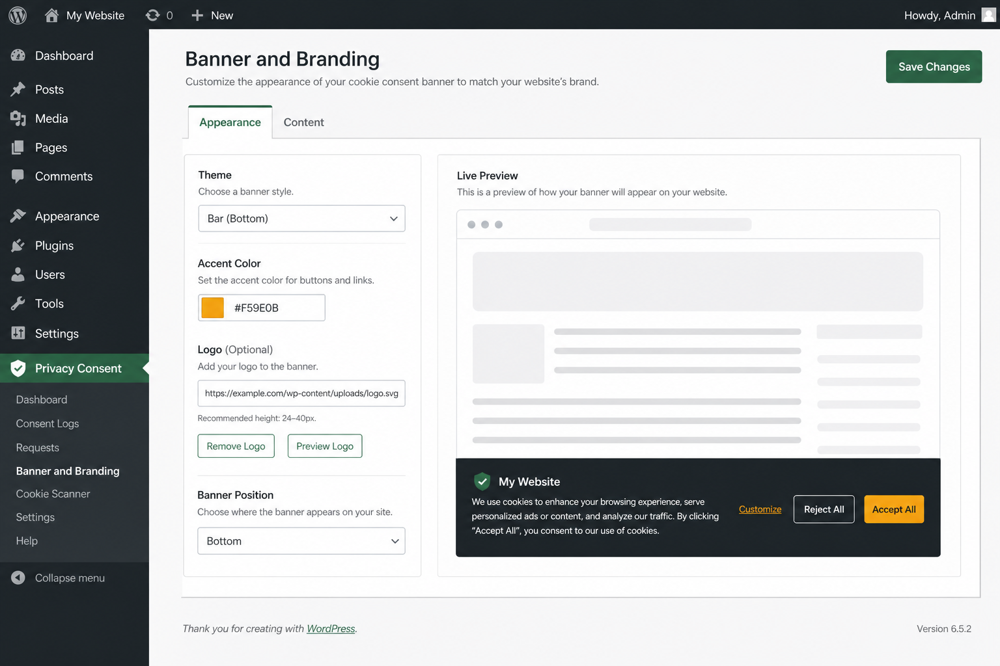
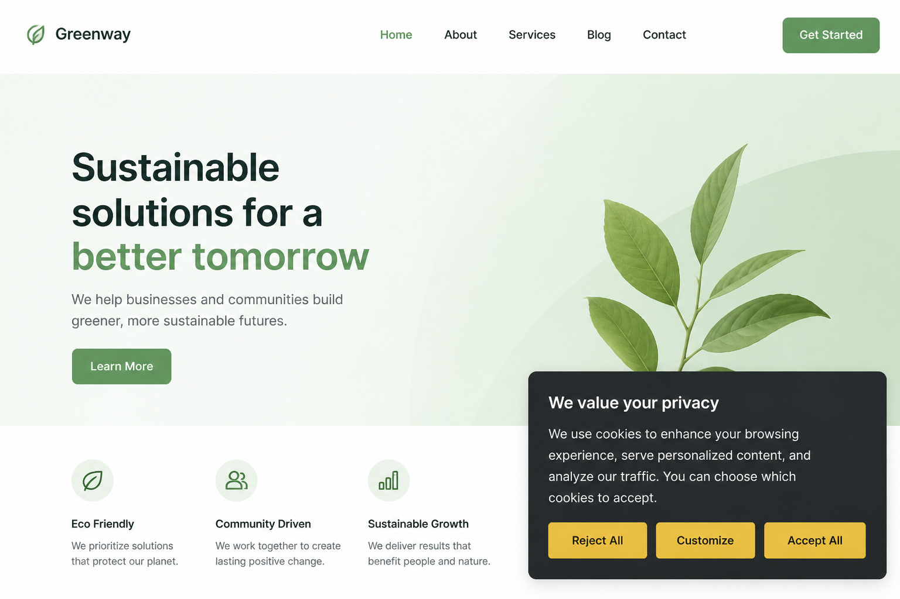
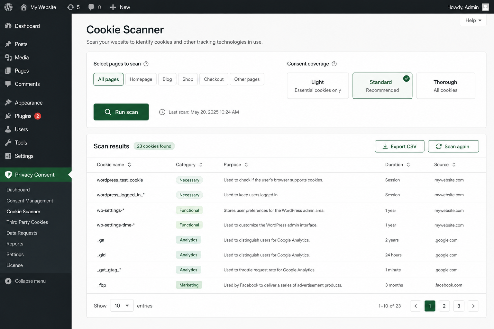

# Universal Consent & Privacy Framework (UCPF)

  

  

Open-source WordPress privacy & cookie consent toolkit. Strict GDPR-oriented defaults, local-first catalog, optional Playwright deep scanner. **Not legal advice and not a guarantee of regulatory compliance.**

- **Plugin slug:** `universal-consent-privacy-framework`
- **License:** [GPL-2.0-or-later](LICENSE)
- **Never phones home** (remote registry off by default; never loads remote executable code)

## Screenshots

| Banner & Branding | Front-end consent | Cookie Scanner |
|-------------------|-------------------|----------------|
|  |  |  |

Directory / SVN assets (icons, banners, screenshots) live in [`.wordpress-org/`](.wordpress-org/). The plugin zip also ships `assets/branding/` icons for the WP admin menu.

## Quick start

### 1. Install the plugin

1. Download a [release zip](https://github.com/Jeffreyreedjr/Universal-Consent-Privacy-Framework/releases) or run `.\package.ps1` from this repo.
2. Upload to WordPress (**Plugins → Add New → Upload**) or copy the folder to `wp-content/plugins/`.
3. Activate → **Privacy Consent → Setup Wizard**.

Or install from [WordPress.org](https://wordpress.org/plugins/universal-consent-privacy-framework/) once listed (Dashboard updates).

### 2. Brand your business

**Privacy Consent → Banner & Branding:** business name, logo URL, theme (Classic + studio presets), accent colors, custom CSS, optional “Powered by” toggle.

Agencies: see [docs/WHITE-LABEL.md](docs/WHITE-LABEL.md) (`wp-content/ucpf-brand.php`).

### 3. Scan cookies

| Path | When |
|------|------|
| Built-in guest crawl | Always available in Cookie Scanner |
| Local deep scan | `cd tools/ucpf-scanner` → scan CLI → Import JSON |
| Self-hosted scanner API | [docs/SCANNER-SERVER.md](docs/SCANNER-SERVER.md) — Node service + HTTPS + WP Advanced URL/key |

Details: [docs/GETTING-STARTED.md](docs/GETTING-STARTED.md), [tools/ucpf-scanner/README.md](tools/ucpf-scanner/README.md), [docs/SCANNER-SERVER.md](docs/SCANNER-SERVER.md).

## Updates (secure, no phone-home)

1. **WordPress.org** (primary): Dashboard plugin updates via WordPress core.
2. **GitHub Releases** (secondary): download zip + verify SHA256.

There is **no custom phone-home updater**. Prefer branding via settings / `ucpf-brand.php` over forking the plugin folder so you keep WP.org updates.

First public push: [docs/FIRST_PUSH.md](docs/FIRST_PUSH.md). Release process: [docs/RELEASING.md](docs/RELEASING.md).

## Security

See [SECURITY.md](SECURITY.md). Report vulnerabilities via GitHub Security Advisories.

## Contributing

See [CONTRIBUTING.md](CONTRIBUTING.md). Good first contributions: noise filters (`data/noise-filters.json`), vendor catalog, Open Cookie Database rebuild, translations, scanner classify rules.

## Docs

| Doc | Topic |
|-----|--------|
| [GETTING-STARTED](docs/GETTING-STARTED.md) | Install, brand, scan |
| [CLOUDFLARE-CACHE](docs/CLOUDFLARE-CACHE.md) | CF Cache Rules for consent HTML + asset `?ver=` |
| [WHITE-LABEL](docs/WHITE-LABEL.md) | Agency branding without forking |
| [RELEASING](docs/RELEASING.md) | Version tags, WP.org, checksums |
| [DEVELOPER](docs/DEVELOPER.md) | Hooks, registry, REST |
| [SCANNER-SERVER](docs/SCANNER-SERVER.md) | Self-host Playwright API on your VPS |

## Disclaimer

UCPF helps support privacy compliance workflows. Final legal review remains the site owner’s responsibility. Generated policies are templates only.

## Credits

Created and developed by **Jeffrey Reed Jr.**
