# Caching with UCPF (Cloudflare + origin / nginx / Plesk)

This is the full operator guide for **long cache life without breaking consent**. It covers Cloudflare Cache Rules, **Plesk/nginx (required)**, other origin page caches, quiet vs busy site TTLs, what the plugin does on Accept vs on zip deploy, and how this compares to industry CMPs (Complianz-style).

Two different problems get mixed together:

1. **Year-long Cache Files on `.css` / `.js`** can store an HTML soft-404 as a stylesheet. The browser then reports `Refused to apply style… MIME type ('text/html')` until you purge.
2. **Bypassing all CSS, JS, and `/wp-content/uploads/`** sends every image and asset to origin and explodes request volume.

UCPF itself does not flood origin. The banner adds a handful of plugin JS/CSS files. Consent POST hits REST only when someone Accepts / Declines / Saves (nonce + rate limit). What *does* change caching is the `ucpf_consent` cookie: consented **HTML** must not be one shared shell at the edge **or** at origin nginx.

**Do not Bypass every `.css` / `.js` / uploads folder.** Do not Bypass “any request with `ucpf_consent`” without excluding static extensions — after Accept All that cookie is on every request and would disable Cache Files site-wide.

---

## Mental model (nitty-gritty)

```mermaid
flowchart TD
  visitor[Visitor request]
  visitor --> cf[Cloudflare Cache Rules]
  cf -->|anon HTML no consent cookie| cfHit[cf-cache-status HIT]
  cf -->|HTML + ucpf_consent or _ucpf| cfDyn[DYNAMIC / BYPASS to origin]
  cf -->|css js images fonts| cfStatic[HIT long TTL]
  cfDyn --> origin[Origin nginx / LiteSpeed / Apache]
  origin -->|MUST skip or vary on ucpf_consent| php[PHP correct HTML for prefs]
  origin -->|BUG: HTML cache ignores cookie| wrong[Wrong banner / scripts until flush]
  cfStatic --> files[Static files on disk]
```



| Layer | Anon (no `ucpf_consent`) | After Accept / any prefs cookie | CSS / JS / images |
|-------|--------------------------|----------------------------------|-------------------|
| **Cloudflare** | Eligible HTML HIT (shared shell) | DYNAMIC or Bypass HTML only | HIT (not gated by consent cookie) |
| **Origin page cache** (nginx, LiteSpeed, Redis **page** HTML, etc.) | May cache HTML | **Must skip or vary** on `ucpf_consent` / `ucpf_dns` / `_ucpf` | Long TTL OK |
| **Browser** | Normal | Cookie + client gate | `?ver=` busts long Browser TTL |

**Industry (Complianz / WPConsent / Cookiebot):** shared anon HTML + unlock in the browser; exclude CMP JS from minify/delay. **CookieYes-style unique pre-consent ID cookies** fight HTML caching — UCPF does not do that.

**UCPF:** anon HTML is shared and cacheable (Complianz-compatible). After the cookie is set, PHP can vary enqueued tags by category, so **HTML must not be a shared cache entry** (CF or nginx). Static assets stay HITable. Preference change reloads once with `?_ucpf=` (same idea as Complianz `?cmplz_consent=1`).

---

## Consent states → what is cached

### 1. No acceptance (first visit)

- No `ucpf_consent` / `ucpf_dns` cookie.
- HTML is the **same for everyone** (banner + blocked/gated tags) → safe to edge-cache and (carefully) origin-cache.
- UCPF CSS/JS and site CSS/JS/images: long HIT OK.
- Plugin does **not** purge Cloudflare on page view.

### 2. Accept All / Reject All / Save Preferences (transition)

1. Client writes `ucpf_consent` (and backups).
2. REST save (rate-limited) — **does not** call Cloudflare purge.
3. Hard navigation with `?_ucpf=<timestamp>` (and sometimes `#ucpf_c=` handoff for Brave/Woo).
4. CF Bypass on `_ucpf` → one origin HTML render for the new prefs.
5. Client strips `_ucpf` from the URL.

Static files stay HITable; only HTML must miss once.

### 3. Returning visitor (any acceptance mix)

- Cookie present → CF HTML rule must **not** serve the anon shell (exclude cookie from Eligible HTML, or Bypass HTML-only).
- Origin page cache must **skip** that request (see nginx below) or it can undo CF.
- CSS/JS/images still HIT.

### 4. Changing preferences later

Same as transition (2): new cookie + `?_ucpf=` reload. No zone purge.

### 5. Do Not Sell / GPC (`ucpf_dns`)

Treat like `ucpf_consent` for HTML eligibility / origin skip.

---

## Origin / server (required) — Plesk nginx

**Cloudflare alone is not enough** if the origin has its own HTML page cache.

Plesk **Apache & nginx Settings → Enable nginx caching** often uses a cache key like:

`$scheme$request_method$host$request_uri$http_x_http_method_override`

That key **does not include cookies**. If you only skip `wordpress_logged_in_`, then:

1. CF correctly sends a consented user to origin (`DYNAMIC`).
2. nginx may return a **5-minute cached HTML** built for an anonymous (or different) visitor.
3. Banner/scripts look wrong until you flush nginx or wait for timeout — easy to blame “Cloudflare” when origin is the bug.

### Required: skip nginx cache for UCPF

In **Additional nginx directives** (or next to your existing `$skip_cache` cookie checks), add:

```nginx
# UCPF — never serve shared HTML to consented / DNS-opt-out / preference-reload traffic
if ($http_cookie ~* "ucpf_consent") {
	set $skip_cache 1;
}

if ($http_cookie ~* "ucpf_dns") {
	set $skip_cache 1;
}

if ($arg__ucpf) {
	set $skip_cache 1;
}
```

Also keep your existing skips for logged-in, cart/checkout, `wp-admin`, etc. After saving, **Clear cache** once in the Plesk nginx caching UI.

### Static files on nginx (optional, fine)

Serving `css|js|…` with `expires 365d` and `Cache-Control: public, max-age=31536000` is fine **with** WordPress `?ver=` and Cloudflare **not** Ignore Query String. Prefer `immutable` only when the URL changes on content change (`?ver=`).

### Other origin stacks

| Stack | What to do |
|-------|------------|
| **LiteSpeed Cache** | Exclude / do not cache when cookie `ucpf_consent` or `ucpf_dns` present; exclude UCPF JS from JS delay/minify; purge after enabling UCPF or changing blocking. |
| **WP Rocket / FlyingPress / etc.** | Same cookie exclusion for page cache; never delay `network-gate`, `consent`, `loader`. |
| **Redis Object Cache** (PhpRedis / Redis Object Cache plugin) | **No** consent-cookie skip — this is options/transients/object groups, not full-page HTML. On UCPF zip/update the plugin invalidates the `ucpf` object-cache group and OPcache for UCPF PHP. Do **not** “Flush Everything” in the Redis UI on every upload unless debugging (causes stampedes). |
| **OPcache** | Not a page cache. UCPF invalidates its own `.php` files on asset bust (same-version zip overwrites). If a page still behaves like an old build after deploy, restart php-fpm once or Flush Object Cache once in WP admin. Optional: `add_filter( 'ucpf_opcache_reset_on_bust', '__return_true' )` for a full `opcache_reset()` (shared hosts: leave off). |
| **Redis full-page HTML** (rare) | Same skip as nginx: `ucpf_consent` / `ucpf_dns` / `_ucpf`; purge page keys after deploy. |
| **Varnish** | Hash or bypass on `Cookie: ucpf_consent` / `ucpf_dns`; bypass `?_ucpf=`. |
| **Apache only (no nginx page cache)** | Less risk; still set sensible `Cache-Control` on static files. |

The Elementor CSS admin notice after a UCPF update means CSS was cleared so layouts rebuild, origin HTML page caches were purged, and CF purge was queued — hard-refresh the front once on a **clean URL**. If a page looks unstyled until Accept All, that is usually stale Hummingbird/nginx HTML missing `elementor-post-{ID}.css` (Accept’s `?_ucpf=` bypasses it) — purge page cache, do not blame consent gating. If `post-*.css` returns MIME `text/html`, that is still the CF/Elementor path (Bypass or short TTL for `/wp-content/uploads/elementor/css/` only), not Redis Object Cache.

---

## Cloudflare Cache Rules

Free plan is enough. **Last matching rule wins.** Two equivalent HTML approaches:

### Approach A — Positive eligibility (recommended; used on many 7MM zones)

**Cache public HTML** only when **all** of:

- Host is this site  
- `GET` / `HEAD`  
- No file extension (HTML document)  
- Empty query string (optional but common)  
- Not `/wp-admin/`, `/wp-login.php`, `/wp-json/`, `/xmlrpc.php`  
- Cookie does **not** contain `ucpf_consent`  
- Cookie does **not** contain `ucpf_dns`  

Then: **Eligible for cache**, Edge TTL **5–30 minutes** (quiet) or **1–5 minutes** (busy). Status **200–299** → same TTL; **300–599** → No cache.

Consented visitors never match → default **DYNAMIC**. No separate “Bypass consented HTML” rule required.

Example expression shape:

```
(http.host in {"example.com" "www.example.com"} and http.request.method in {"GET" "HEAD"} and http.request.uri.path.extension eq "" and http.request.uri.query eq "" and not http.request.uri.path contains "/wp-admin/" and not http.request.uri.path contains "/wp-login.php" and not http.request.uri.path contains "/wp-json/" and not http.request.uri.path contains "/xmlrpc.php" and not http.cookie contains "ucpf_consent" and not http.cookie contains "ucpf_dns")
```

### Approach B — Cache all HTML + Bypass consented last

Eligible HTML for pages without static extensions, then a **last** rule:

```
((http.cookie contains "ucpf_consent") or (http.cookie contains "ucpf_dns")) and not http.request.uri.path.extension in {"7z" "ac3" "apk" "avi" "avif" "bin" "bmp" "bz2" "class" "css" "cue" "csv" "dat" "dmg" "doc" "docx" "dts" "ejs" "eot" "eps" "exe" "flac" "flv" "gif" "gz" "ico" "img" "iso" "jar" "js" "jpeg" "jpg" "mid" "midi" "mkv" "mp3" "mp4" "mpeg" "mpg" "ogg" "otf" "pdf" "pict" "pls" "png" "ppt" "pptx" "ps" "qt" "rar" "rm" "svg" "svgz" "swf" "tar" "tgz" "tif" "tiff" "ttf" "txt" "wav" "webm" "webp" "woff" "woff2" "xls" "xlsx" "zip" "zst"}
```

Bypass cache. **Must** exclude static extensions or Accept All kills CSS/JS caching.

### Cache Files (static)

Match common static extensions including `css` `js` `png` `webp` `woff2` etc.

- Eligible for cache  
- Edge TTL **1 year** for images/media (or for css/js too if `?ver=` always changes on deploy)  
- **Required:** Status code TTL **400–599 → No cache (0)** — stops soft-404 HTML sticking as CSS  
- **Do not** Ignore Query String  
- Browser TTL: Respect origin, **or** 1 year if you accept that only a new `?ver=` refreshes browsers after purge  

Optional: separate shorter Edge TTL (4h–1d) for `css`/`js` after the year rule (last match wins) on **busy** sites.

### Bypass WordPress Admin and Logged In Users

Keep Bypass for `/wp-admin/`, `/wp-login.php`, `/wp-json/`, Woo cart/checkout/account, logged-in cookies, cart cookies, preview query args, etc.

**Watch `PHPSESSID`:** if any plugin sets it for **guests**, anon HTML never HITs. Prefer removing `PHPSESSID` from Bypass unless you need it.

### Bypass UCPF preference reload

```
(http.request.uri.query contains "_ucpf")
```

Bypass cache. Place after admin Bypass (or last among Bypass rules).

**Do not** add Transform Rules that strip `_ucpf`. Rocket Loader off for UCPF tags (`data-cfasync="false"` is already set on gate / consent / loader).

### Suggested rule order

1. Cache public HTML (Approach A) — first  
2. Cache Files  
3. Bypass Admin / Woo / logged-in  
4. Bypass `_ucpf` — last  

| Request | Expected `cf-cache-status` |
|--------|----------------------------|
| Anon homepage HTML | `HIT` / `MISS` (Age under HTML TTL) |
| HTML after Accept (`ucpf_consent`) | `DYNAMIC` (Approach A) or `BYPASS` (Approach B) |
| `?_ucpf=` | `BYPASS` / `DYNAMIC` |
| Theme / UCPF `.css` / `.js` after Accept | `HIT` (Cache Files) |
| JPG / WebP | `HIT` long Age |

---

## Quiet vs busy site TTLs

Keep the **same rule shape**; only change numbers.

| Asset | Quiet (rare content changes) | Busy (constant Elementor / content edits) |
|-------|------------------------------|-------------------------------------------|
| Images / media | 1 year | 1 year (or 1 day if media churns) |
| Theme / plugin / UCPF CSS+JS | 1 day – 1 year + `?ver=` | 1–4 hours Edge (or year + reliable `?ver=`) |
| Elementor `uploads/.../css/` | Year OK with `?ver=` + 400–599→0 | **60–300s** Edge or narrow Bypass that folder only |
| Anon HTML | **5–30 minutes** | **1–5 minutes** |
| Consented HTML | Always DYNAMIC / Bypass | Same |
| `_ucpf` | Always Bypass | Same |
| nginx HTML | Skip UCPF cookies | Same |

Enable UCPF **Cloudflare purge on updates** (Advanced) on fleets that zip-deploy often so long CSS TTL does not require a manual dashboard flush.

---

## What the plugin does to caches

### On Accept / Reject / Save

- Sets `ucpf_consent` (client + server cookie helpers).  
- REST log — **no** Cloudflare purge.  
- Reloads with `?_ucpf=` so HTML is not the stale anon shell.

### On UCPF zip / version upgrade / theme switch / (optional) other plugin updates

- Bumps asset `?ver=` (`UCPF_VERSION` + file **size** + **crc32b** + optional `ucpf_assets_rev`) so edge/browser keys change even when zip tools preserve mtimes.  
- Invalidates Redis Object Cache group `ucpf` (or known catalog keys) and OPcache for UCPF PHP files — **not** a full Redis / `wp_cache_flush` (see Redis / OPcache rows under Other origin stacks).  
- May open a short front-HTML `CDN-Cache-Control: no-store` window after zip fingerprint change.  
- If **Automatic Cloudflare purge** is enabled: queues purge on request shutdown (`purge_everything` + pending file URLs; zip/update can bypass the 10-minute debounce). Soft-hooks the official Cloudflare WordPress plugin when present.  
- Does **not** wipe LiteSpeed / Rocket / Autoptimize on origin by default (those races can delete optimized CSS while CF still holds poison).  
- Elementor: optional clear of Elementor CSS cache + purge prefixes for `uploads/elementor/css/`.

### Asset version format

`?ver=UCPF_VERSION[.size.crc32b][.ucpf_assets_rev]` via `ucpf_asset_version()` — see [DEVELOPER.md](DEVELOPER.md).

---

## Elementor `post-*.css`

Path: `/wp-content/uploads/elementor/css/post-*.css?ver=<filemtime>`.

UCPF never consent-gates these. Year-TTL Cache Files **without** 400–599→0 (or with Ignore Query String) can store soft-404 HTML as CSS.

- Prefer short Edge TTL (60–300s) **or** Bypass **only** that folder — not all of `/uploads/`.  
- After updates, UCPF can clear Elementor CSS and queue CF purge (Advanced setting, default on). It also purges origin **HTML page caches** (Hummingbird Page Cache, WP Rocket, LiteSpeed, etc.) and always heals the **current page** CSS on enqueue.
- **“Unstyled until Accept All” is usually page cache, not consent:** Accept reloads with `?_ucpf=` (CF/origin Bypass). If the clean URL was cached without `elementor-post-{ID}-css` in `<head>`, layout looks broken until Accept. Ops: purge Hummingbird Page Cache (or nginx/Plesk) for that URL; View Source on the clean URL must show the page CSS link **before** any consent cookie. Example canary: Jackazz `/fwgs-locations/` missing `post-2785.css` on `/` but present with any query string.

---

## Emergency Bypass (debug only)

Bypassing all CSS, JS, and uploads stops poison but floods origin. Short debug window only:

```
(http.request.uri.path contains "/wp-content/plugins/universal-consent-privacy-framework/") or (http.request.uri.path contains "/wp-content/uploads/") or (ends_with(http.request.uri.path, ".css")) or (ends_with(http.request.uri.path, ".js")) or (http.request.uri.query contains "_ucpf") or (http.cookie contains "ucpf_consent") or (http.cookie contains "ucpf_dns")
```

---

## Settings checklist

| Setting | Guidance |
|--------|----------|
| **Origin nginx / LiteSpeed page cache** | **Must** skip `ucpf_consent`, `ucpf_dns`, `_ucpf` |
| **Rocket Loader** | Off site-wide, or never rewrite UCPF tags |
| **Auto Minify / Delay JS** | Exclude UCPF gate, consent, loader |
| **Cache Files 400–599** | TTL 0 |
| **Ignore Query String** | Off for CSS/JS |
| **Browser Cache TTL on HTML** | Do not force long browser TTL on HTML |
| **PHPSESSID in CF Bypass** | Remove if guests get sessions and anon HTML never HITs |
| **UCPF purge API** | Recommended for fleets that zip-update often |
| **Transform Rules** | Do not strip `_ucpf` |

---

## Validation

1. Private window, no Accept: HTML `cf-cache-status` HIT/MISS; Age under HTML TTL.  
2. Accept All: URL briefly has `?_ucpf=` → BYPASS/DYNAMIC → then consented page; CSS/JS still HIT.  
3. Return with cookie: HTML DYNAMIC/BYPASS; images HIT long Age.  
4. DevTools: theme/UCPF `.css` is `text/css`, never `text/html`.  
5. After Accept, confirm **origin** is not serving stale HTML (with nginx skip in place, `x-cache-status` / nginx HIT should not apply to cookied HTML).  
6. Same-version zip: new `?ver=` on `consent.js` without requiring a full CF dashboard flush when purge API or content hash is live.

Probe helper (repo): `tools/probe-cache-headers.ps1 -BaseUrl https://example.com`

Also see Advanced Settings → **CDN / Cloudflare assets** and [DEVELOPER.md](DEVELOPER.md) § Front-end asset versions / CDN. Canary checklist: [CANARY-QA.md](CANARY-QA.md).

---

## Automatic purge API (optional but required for “purge on UCPF update”)

When Bypass rules are incomplete or HTML/CSS stay sticky after **UCPF zip / activate / version upgrade**, enable **Automatic Cloudflare purge API** under Advanced → CDN / Cloudflare:

1. API Token: **Zone → Cache Purge** + **Zone → Zone → Read**.  
2. Domain + token in UCPF; check **Enable Cloudflare cache purge on updates** and **Purge after UCPF activate / version upgrade / same-version zip overwrite**.  
3. **No WP-Cron.** Hosts with external cron runners that disable `wp-cron.php` are fine. On UCPF update / zip fingerprint / activate, UCPF queues a sticky purge and runs it on **request shutdown**, then retries on the next **front or admin** `init` until the API succeeds (60s backoff between failures). Soft-hooks the official Cloudflare WordPress plugin when present.  
4. Same-version zip and UCPF update **bypass the 10-minute purge debounce**. Prefix purge for Elementor CSS when allowed, then `purge_everything`, plus queued UCPF asset URLs.  
5. Does **not** clear Autoptimize / LiteSpeed / Rocket on origin.

If purge never runs after a zip: confirm the master **Enable** checkbox and token are saved, then load any front page or wp-admin once (triggers the sticky retry). Last purge status appears on the same settings screen. Leave the token field blank when saving other settings to keep the existing token.

---

## After a plugin zip upload

**Cache public HTML** stores each URL separately. After you replace UCPF, Cloudflare may still have previous HTML until that URL is requested (MISS), the purge API runs, or you Purge Everything once.

During zip extract, WordPress may still mark UCPF active. Current builds **bail out soft** if core files are missing/truncated (site stays up without the banner briefly) instead of white-screening the front end.
